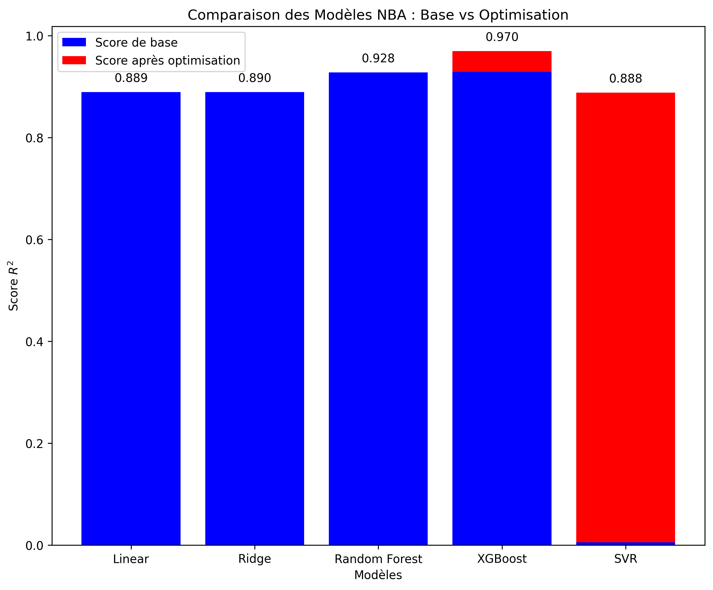
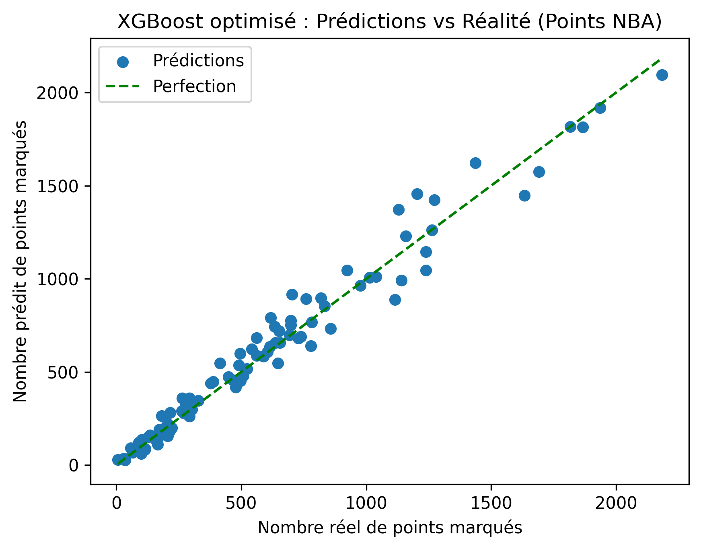
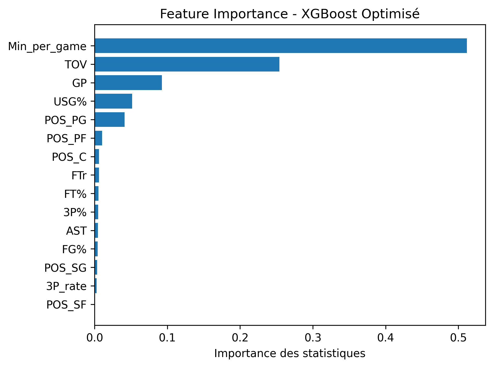

# 🏀 Prédiction de Performance des Joueurs NBA

Prédiction des points totaux des joueurs NBA en utilisant le Machine Learning et des statistiques avancées.

## 🎯 Résultats

**Modèles comparés :**
- Linear Regression : R² = 0.889
- Ridge : R² = 0.890
- Random Forest : R² = 0.928
- SVR : R² = 0.006 → **0.888** (après optimisation)
- XGBoost : R² = 0.929 → **0.970** (après optimisation) ✅

**Meilleur modèle : XGBoost optimisé**
- **R² = 0.970** (97% de la variance expliquée)
- **MAE ≈ 58.6 points** (erreur absolue moyenne)

Le modèle prédit les points totaux avec une précision de 97%, ce qui signifie qu'il capture presque toutes les relations entre les statistiques de jeu et le scoring.

## 📊 Features utilisées

### Statistiques avancées NBA
- **Usage Rate (USG%)** : Part des possessions de l'équipe utilisées par le joueur
- **Pace** : Rythme de jeu de l'équipe (possessions par 48 minutes)
- **Free Throw Rate (FTr)** : Ratio tentatives de lancers francs / tentatives de tirs (mesure l'agressivité)
- **3P Rate** : Proportion de tirs à 3 points (style de jeu)

### Statistiques de base
- Pourcentages : FG%, 3P%, FT%
- Volume : Minutes, Games Played, Assists, Turnovers
- Position : One-hot encoding (PG, SG, SF, PF, C)

**Total : 15 features** sélectionnées après analyse de corrélations

## 🔍 Insights clés

### Feature Importance (XGBoost)
Les features les plus importantes pour prédire les points sont :
1. **Usage Rate** : Plus un joueur utilise de possessions, plus il score
2. **Free Throw Rate** : Les joueurs agressifs au panier marquent plus
3. **Minutes & Games Played** : Plus de temps de jeu = plus d'opportunités
4. **Position** : Les meneurs scorent différemment des pivots

### Ce que le modèle a appris
- Les **tentatives de tirs** et le **temps de jeu** sont les meilleurs prédicteurs
- Le **rôle dans l'équipe** (USG%) est crucial : les stars avec usage élevé scorent naturellement plus
- L'**efficacité** (FG%, 3P%) compte autant que le **volume** de jeu
- Les **positions** influencent le scoring 

## 🛠️ Technologies utilisées

- **Python 3.x**
- **Pandas, NumPy** : Manipulation de données
- **scikit-learn** : Modèles ML, pipelines, GridSearchCV
- **XGBoost** : Gradient Boosting optimisé
- **Matplotlib, Seaborn** : Visualisations

## 📈 Méthodologie

### 1. Nettoyage des données
- Suppression des valeurs manquantes
- Filtrage : joueurs avec ≥10 matchs et ≥10 minutes

### 2. Feature Engineering
- Création de statistiques avancées NBA (USG%, Pace, FTr)
- One-hot encoding des positions
- Features custom (Playmaking, Def_impact)

### 3. Entraînement
- Train/test split : 80/20
- Pipeline avec StandardScaler (normalisation)
- Comparaison de 5 algorithmes ML

### 4. Optimisation
- GridSearchCV avec validation croisée (5-fold)
- Optimisation des hyperparamètres pour SVR et XGBoost
- Meilleur modèle : XGBoost (n_estimators=500, max_depth=3, learning_rate=0.05)

## 📈 Visualisations

### Comparaison des modèles


### Prédictions vs réalité


### Importance des différentes features


## 🚀 Installation et utilisation

```bash
# Cloner le repository
git clone https://github.com/Akihitorh/NBA-Performance-Prediction.git
cd NBA-Performance-Prediction

# Installer les dépendances
pip install -r requirements.txt

# Lancer le projet
python ProjetNBA.py
```

## 📁 Structure du projet

```
NBA-Performance-Prediction/
├── ProjetNBA.py                    # Script principal
├── 2023_nba_player_stats.csv      # Dataset NBA 2023-2024
├── requirements.txt                # Dépendances Python
├── README.md                       # Documentation
├── images/                         # Visualisations générées
│   ├── model_comparison.png
│   ├── predictions_vs_reality_xgboost.png
│   └── feature_importance_xgboost.png
└── .gitignore
```

## 📚 Ce que j'ai appris

- **Feature engineering** avec des statistiques NBA officielles (USG%, Pace)
- **Comparaison de modèles** : pourquoi XGBoost surpasse Linear Regression
- **GridSearchCV** pour optimisation d'hyperparamètres avec validation croisée
- **Pipeline scikit-learn** avec StandardScaler pour normalisation
- **Analyse de feature importance** pour comprendre les prédicteurs clés

## 🎓 Contexte

Ce projet a été développé de manière indépendante parallèlement à mes études à l'ESILV.
Il reflète mon intérêt personnel pour la science des données et l'intelligence artificielle, domaines que j'explore actuellement.

## 📧 Contact

Akihito RAFFIN-HOSAKA
- LinkedIn : https://www.linkedin.com/in/akihito-raffin-hosaka-286aaa331/
- Email : akihito.raffinhosaka@gmail.com

---

**⭐ Si ce projet vous intéresse, n'hésitez pas à le star !**
